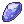
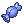

<div align="center">
  <picture>
    <source media="(prefers-color-scheme: dark)" srcset="/docs/logo-white.png">
    <source media="(prefers-color-scheme: light)" srcset="/docs/logo.png">
    
  </picture>
  <p align="center">Collect all Pokémon through GitHub contributions!<br/><a href="https://app.gitpokecol.org">app.gitpokecol.org</a> </p>
</div>
<div align="center">
    <a href="/README.md">english</a> · <a href="/docs/README_kr.md">한국어</a>
</div>

## Pokémon Collection

Decorate your GitHub profile with Pokémon collection!

<a href="https://app.gitpokecol.org">
    
</a>

Go to the [website](https://app.gitpokecol.org) to create your collection! You can adjust your Pokémon's moving direction, background, size in the profile.

Or copy and paste this into your markdown or html.  
Replace `{username}` with your GitHub username.

```
<a href="https://app.gitpokecol.org">
  
</a>
```

## Daily Item

Visit the [website](https://app.gitpokecol.org) to claim a daily item!  
You can get an Evolution Stone , Rare Candy, Plate Item and more as a daily reward!

## Commit Points (CP)

Commit Points that display as "cp" represent your total GitHub contributions.  
Rewards are given as follows:

- 1 unique Pokémon is given for every 50 CP.
- A random Pokémon you own levels up for every 2 CP.

## Image Source

The sprites are from [www.pokencyclopedia.info](www.pokencyclopedia.info).
As [The License](/LICENSE.md) states, all Pokémon images are the property of Nintendo.
